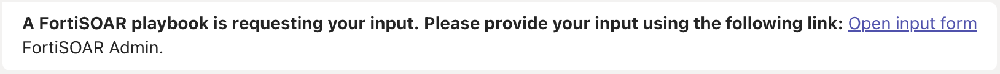
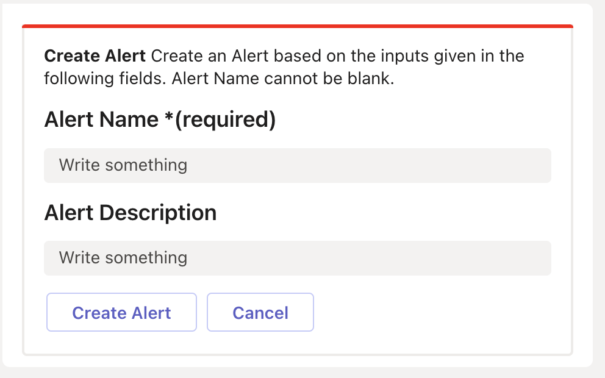

| [Home](../README.md) |
|----------------------|

# Contents

The **FortiSOAR&trade; for Microsoft Teams** solution pack contains the following resources.

## Connectors

| Name            | Description                                                                                                                                                                                                                                              |
|:----------------|:---------------------------------------------------------------------------------------------------------------------------------------------------------------------------------------------------------------------------------------------------------|
| Microsoft Teams | Microsoft Teams is a chat-based workspace in Office 365 that provides global, remote, and dispersed teams with the ability to work together and share information using a common space. This connector facilitates automated operation related to teams. |

## Notification Channel

Notification channels help define various modes of delivering a notification. Channels can be referred to as categories that define how a notification using that channel is delivered to the user.

| Name                 | Description                                                                                                          |
|:---------------------|:---------------------------------------------------------------------------------------------------------------------|
| Microsoft Teams Link | Sends a **message** to Microsoft Teams application when a rule using this channel is triggered.                          |
| Microsoft Teams      | Sends an **inline interactive form** to the Microsoft Teams application when a rule using this channel is triggered. |

## Rules

Rules provide a framework to define a condition that generates notifications.

| Name                                                   | Description                                                                                                                          |
|:-------------------------------------------------------|:-------------------------------------------------------------------------------------------------------------------------------------|
| Microsoft Teams > Notify on External Manual Input Form | Sends an **inline interactive form** to the Microsoft Teams application when the manual input step for Microsoft Teams is triggered. |
| Microsoft Teams > Notify on Playbook failure           | Sends an error when a playbook with a `bot_enabled` tag fails.                                                                       |
| Microsoft Teams > Send Manual Input link               | Sends a link to Microsoft Teams to click and open the manual input form on FortiSOAR&trade; interface.                               |

When creating notification rules, selecting **Manual Input** as a notification trigger, makes following conditions available:

- **External Channels (Inline)** - The following image shows an **inline interactive form** that appears with other FortiSOAR&trade; messages in Microsoft Teams.

    

- **External Channels (Link)** - The following image shows a message that contains a **link to a manual input form** on FortiSOAR&trade; interface.

    

## Playbook Collection

| 02 - Use Case - FortiSOAR for Microsoft Teams |
|:----------------------------------------------|

| Playbook Name          | Description                                                                                                                                   |
|:-----------------------|:----------------------------------------------------------------------------------------------------------------------------------------------|
| Create Indicator       | Extracts indicators from the text provided as input                                                                                           |
| Create Alert           | Creates an alert based on the values provided in the form                                                                                     |
| Enrich IP              | Triggers *Enrich IP > Enrichment* playbook to enrich the IP address specified through `enrichIP` command in Microsoft Teams application.      |
| Enrich IP > Enrichment | Enriches an IP address using VirusTotal and IPStack as threat intelligence solutions and displays the summary on Microsoft Teams application. |

## Next Steps

| [Installation](./setup.md#installation) | [Configuration](./setup.md#configuration) | [Usage](./usage.md) |
|-----------------------------------------|-------------------------------------------|---------------------|
