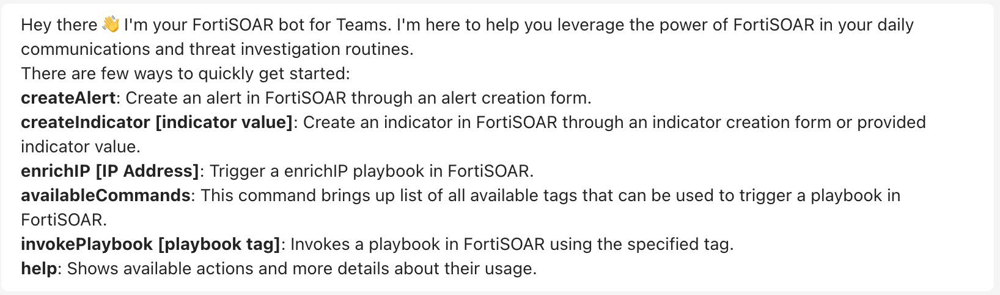

| [Home](../README.md) |
|----------------------|

# Usage

After completing the set up of FortiSOAR for Microsoft Teams application, you can begin using the app as described in the [FortiSOAR&trade;-Microsoft Teams Application Usage](https://docs.fortinet.com/document/fortisoar/1.0.0/fortisoar-for-microsoft-teams-application/630/fortisoar-for-microsoft-teams-application-v1-0-0#FSRMsTeamsUsage) section of FortiSOAR&trade; product documentation.

This section gives a brief description on the commands used in FortiSOAR for Microsoft Teams application.

## `@fortiSOAR createAlert`

This command performs the following actions:

1. Displays a **Create New Alert** form.
2. Takes the name and description entered in the inline interactive form on the Microsoft Teams application to create a new alert in FortiSOAR&trade;.

You can create alerts on the fly for further investigation by the Security Operations Center (SOC) team.

For more information and examples for this command, refer to the [Adding an Alert](https://docs.fortinet.com/document/fortisoar/1.0.0/fortisoar-for-microsoft-teams-application/630/fortisoar-for-microsoft-teams-application-v1-0-0#Adding_an_alert) section of FortiSOAR&trade; product documentation.

## `@fortiSOAR createIndicator`

This command performs the following actions:

1. Displays a **Create New Indicator** form.
2. Takes the indicator value from the command to create an indicator in FortiSOAR&trade; with the information specified in the inline interactive form on the Microsoft Teams application.

### Syntax

```
@fortiSOAR createIndicator <indicator_value>
```

### Example

```
@fortiSOAR createIndicator gumblar.cn
```

This command creates an indicator of value `gumblar.cn` in FortiSOAR&trade;

You can create indicators on the fly for enrichment and further investigation by the Security Operations Center (SOC) team.

For more information and examples for this command, refer to the [Adding an indicator with the indicator value specified](https://docs.fortinet.com/document/fortisoar/1.0.0/fortisoar-for-microsoft-teams-application/630/fortisoar-for-microsoft-teams-application-v1-0-0#Adding_an_indicator_with_the_indicator_value_specified) section of FortiSOAR&trade; product documentation.

## `@fortiSOAR availableCommands`

This command brings up lists all available tags that can be used to trigger a playbook.
```
@fortiSOAR availableCommands
```

## `@fortiSOAR invokePlaybook`

This command takes another argument `<tag_name>` to trigger a FortiSOAR&trade; playbook containing the tag `<tag_name>`.

> **NOTE**:  If there are multiple playbooks with the same tag, the first found playbook is triggered.

To create playbooks that can be triggered from Microsoft Teams chat interface, refer to [Create a custom playbook to be triggered from Microsoft Teams](https://docs.fortinet.com/document/fortisoar/1.0.0/fortisoar-for-microsoft-teams-application/630/fortisoar-for-microsoft-teams-application-v1-0-0How_to_create_a_custom_playbook_that_can_be_triggered_from_Microsoft_Teams_) section of FortiSOAR&trade; product documentation.

You can design the manual input modal in FortiSOAR&trade; to send interactive inline forms on Microsoft Teams application's chat interface. Refer to this [example of running a Manual Input playbook that uses Microsoft Teams as a delivery medium](https://docs.fortinet.com/document/fortisoar/1.0.0/fortisoar-for-microsoft-teams-application/630/fortisoar-for-microsoft-teams-application-v1-0-0#Example_of_running_a_Manual_Input_playbook_that_uses_Microsoft_Teams_as_a_delivery_medium).

<table>
    <tr>
        <td><strong>NOTE</strong></td><td>The playbooks being invoked must also have a <code>bot_enabled</code> tag.</td>
    </tr>
</table>

### Syntax

```
@fortiSOAR invokePlaybook <tag_name>
```

### Example

```
@fortiSOAR invokePlaybook getIPRep
```

The command triggers FortiSOAR&trade; playbooks with the tag `getIPRep`.

For more information and examples for this command, refer to the [Example of invoking a FortiSOAR playbook from Microsoft Teams](https://docs.fortinet.com/document/fortisoar/1.0.0/fortisoar-for-microsoft-teams-application/630/fortisoar-for-microsoft-teams-application-v1-0-0#Example_of_invoking_a_FortiSOAR_playbook_from_Microsoft_Teams_) section of FortiSOAR&trade; product documentation.

## `@fortiSOAR help`

This command brings up the available commands and their usage details. Following image shows the FortiSOAR&trade; help message on Microsoft Teams application:



## Next Steps

| [Installation](./setup.md#installation) | [Configuration](./setup.md#configuration) | [Contents](./contents.md) |
|-----------------------------------------|-------------------------------------------|---------------------------|